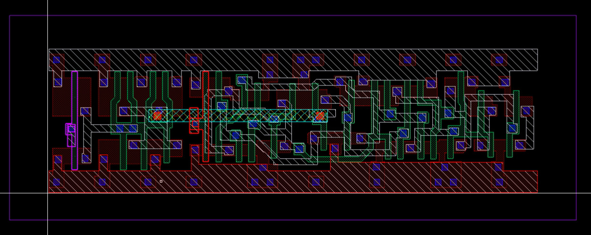
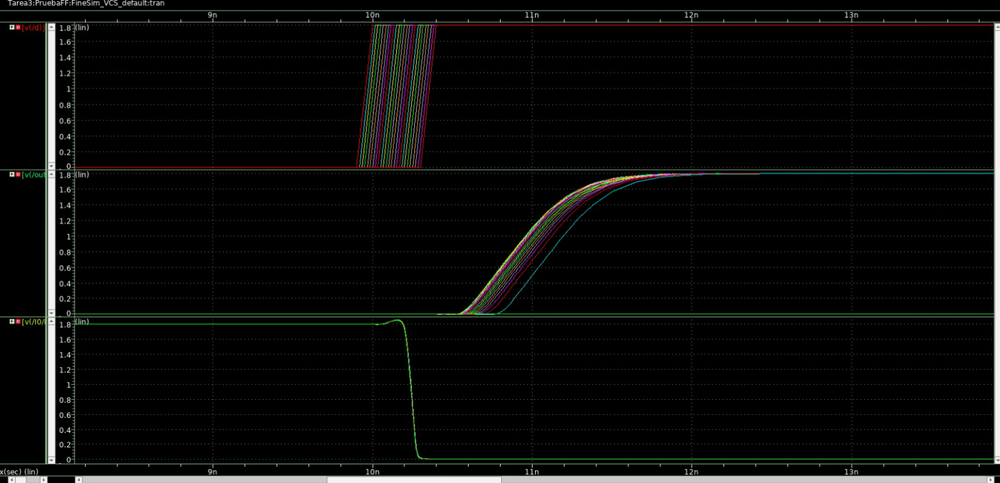
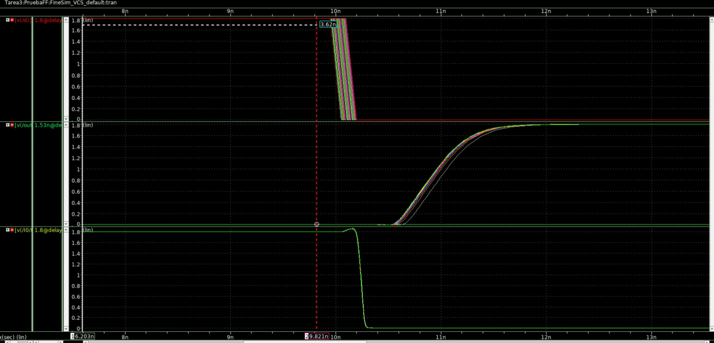
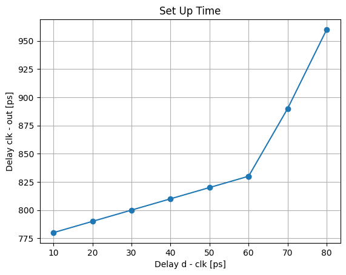
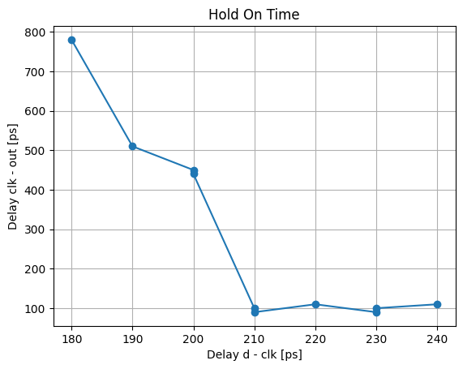
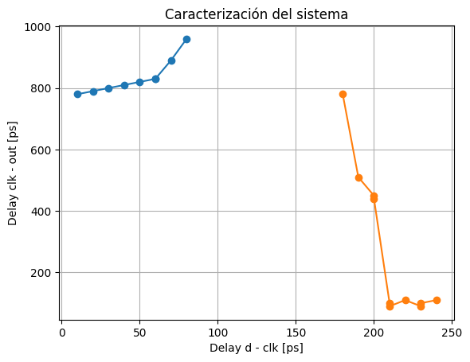

# Tarea 3
Autores:

* Jeremy Cordoba Wright
* Irán Medina Aguilar

## Introducción

n esta tarea, se procederá a la instanciación y caracterización de un flip flop estático Amo-Esclavo de 1 bit utilizando la herramienta Custom Compiler. Se empleará la celda DFFHDLLX0 de la librería D_CELLS_HDLL para el diseño, la cual carece de reset y cuenta únicamente con las entradas D y CN, generando salidas Q y QN. Se implementará un reloj utilizando inversores para controlar la señal de reloj del flip flop, permitiendo así simular de manera realista la pendiente de la señal de reloj. Posteriormente, se llevará a cabo una simulación en Hspice a nivel de trazado para determinar y comparar los parámetros de tiempo de setup (tsetup) y tiempo de retardo (thold) con los valores provistos por Liberty Displayer, mediante la técnica de variación de tcd y la medición de tpcq, siguiendo la metodología descrita en el documento de caracterización de celdas.

## Datos Relevantes

* Uso de la tecnología XH018
* El calculo de los valores de la parte 1 pueden observasrse en el archivo Tarea_1.pdf
* Simulador: HSpice
* Herramienta de diseño: custom compiler
* λ = 90µm.
* SUPPLY = 1.8V

## Resultados

Para la optención de los resultados se instanció tanto el esquematico como el layout del flip flop DFFHDLLX0 junto con 2 inversores de 1x y 4x los cuales acondicionan la señal para tener una señal de clock realista. Este se encuentra presente en la biblioteca del curso. A continuacion se muestra una imagen tanto del layout como del esquemático. 

Posteriormente, se procedio a la optención de set up time y hold time característicos del flip flip menciondo. Para esto se uitlizó, lo visto en [2], y mediante simulación en Hspice a nivel de trazado (LPE) se comprobó los parámetros de tsetup, thold, usando la técnica de variación de tcd y midiendo tpcq. Para esto se utilizó un metodo de barrido de la fuente y se medio la señal de clock, las entradas de los datos y la salida. A continuación se puede ver ejemplo de las simulaciones. 

Para el set up time se obtuvo la respuesta mostrada en la siguiente figura. 

Para el hold time se obtuvo la respuesta mostrada en la siguiente figura.

Por lo que la caracterización del sistema corresponde al mostrado en la siguiente figura.

Comprando el set up time y el hold time encontrado con las características en el Liberty Displayer se obtuvo. 

| Time | Medido | Liberty Displayer | % de eror |
|-----------|-----------|-----------|-----------|
| Set Up   |Fila 1,2  | Fila 1,3  | Fila 1,4  |
| Hold    | Fila 2,2  | Fila 2,3  | Fila 2,4  |

 
## Análisis 

## Conclusiones

## Referencias
[1] N. Weste and D. Harris, CMOS VLSI Design: A Circuits and Systems Perspective, 4 edition. Boston: Addison-Wesley, 2010.

[2] Process and Device Specification XH018 - 0.18 μm Modular Mixed Signal HV CMOS, PDS-018-13. Release 7.0.1. XFAB Semiconductor Foundries, Nov. 2017.

[3] J. Rabaey, A. Chandrakasan y B. Nikolic. Digital Integrated Circuits: A Design Perspective.

